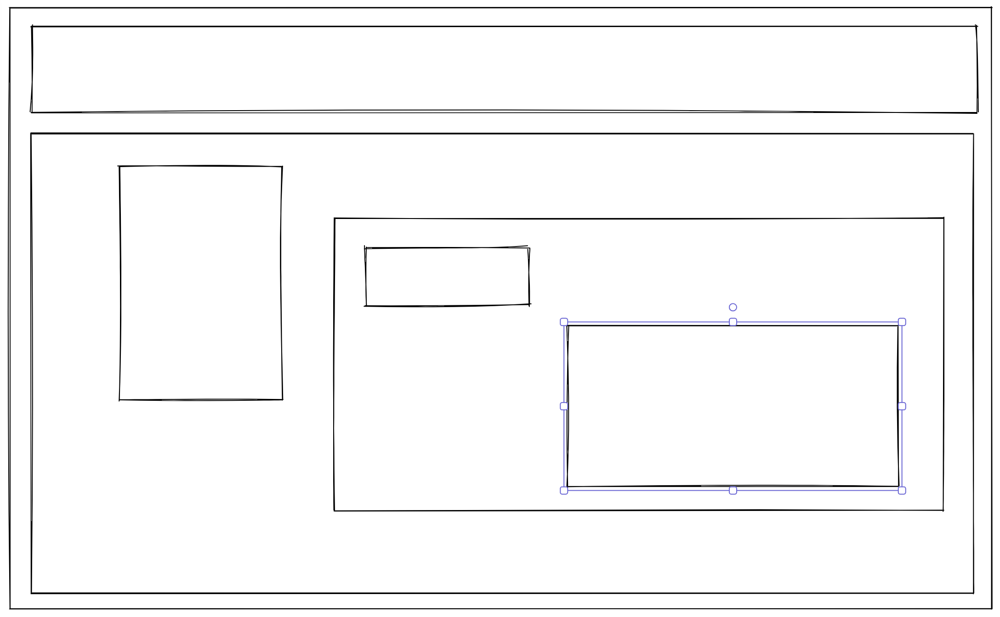
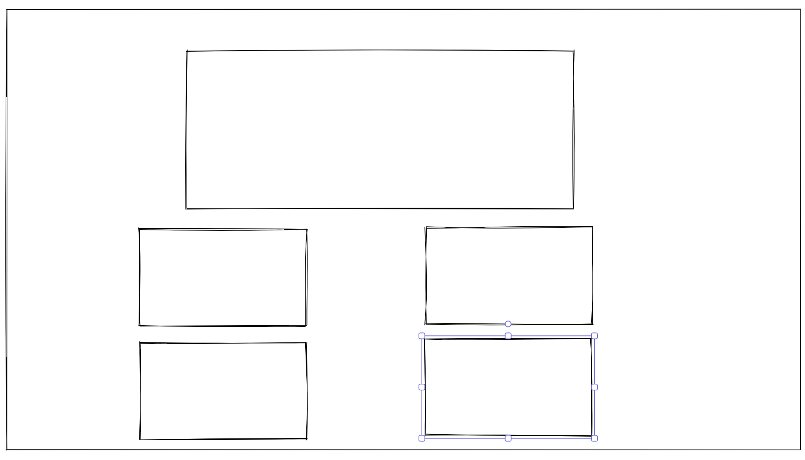
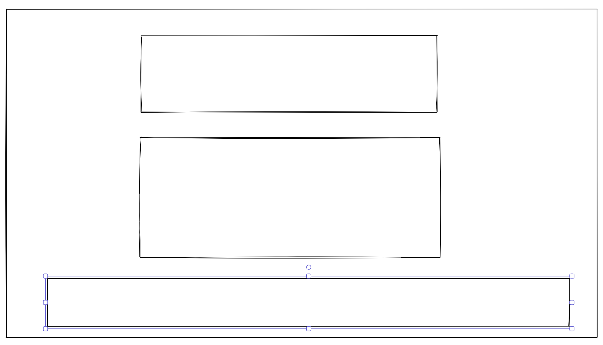

# Portfolio-Module-2

## Purpose

The purpose of this build was to practice with flexbox CSS and responsive design. There was no starter codebase to work from as a challenge to building a landing page for my own portfolio to display to future emplyoeers. Allowing them to access pass projects to show my abilities as a web devloper.

## The User Story

AS AN employer
I WANT to view a potential employee's deployed portfolio of work samples
SO THAT I can review samples of their work and assess whether they're a good candidate for an open position

## Acceptance Criteria

GIVEN I need to sample a potential employee's previous work
WHEN I load their portfolio
THEN I am presented with the developer's name, a recent photo or avatar, and links to sections about them, their work, and how to contact them
WHEN I click one of the links in the navigation
THEN the UI scrolls to the corresponding section
WHEN I click on the link to the section about their work
THEN the UI scrolls to a section with titled images of the developer's applications
WHEN I am presented with the developer's first application
THEN that application's image should be larger in size than the others
WHEN I click on the images of the applications
THEN I am taken to that deployed application
WHEN I resize the page or view the site on various screens and devices
THEN I am presented with a responsive layout that adapts to my viewport

## Learning Moments

Well working on this project, I found how helpful flexbox can be when needing to build a responsive website. When working on the media query section for a moblie design, the flex conaiters were able to re-size the majority of the elements on the page and place them exactly where I need them to be.

Something I had to learn with flexbox is needing to use the height and width proiperties liberally as it can quickly ruin the spaceing around other flex containers on the page. Esspecially with the width property as it will hard stick the flex cointainer's width and no longer be able to automatically adjust the width when re-sizing the browser. Needing to avoid the width property is something to consider on future projects when working with flexbox

Using a Wire Frame is important when planning about the build and design of a website. It helps vizualize the amount of flex containers that'll need to complete the desired design for the website.

Wire Frames can be easy to designed with sites such as [Exalidraw](https://excalidraw.com/)!
